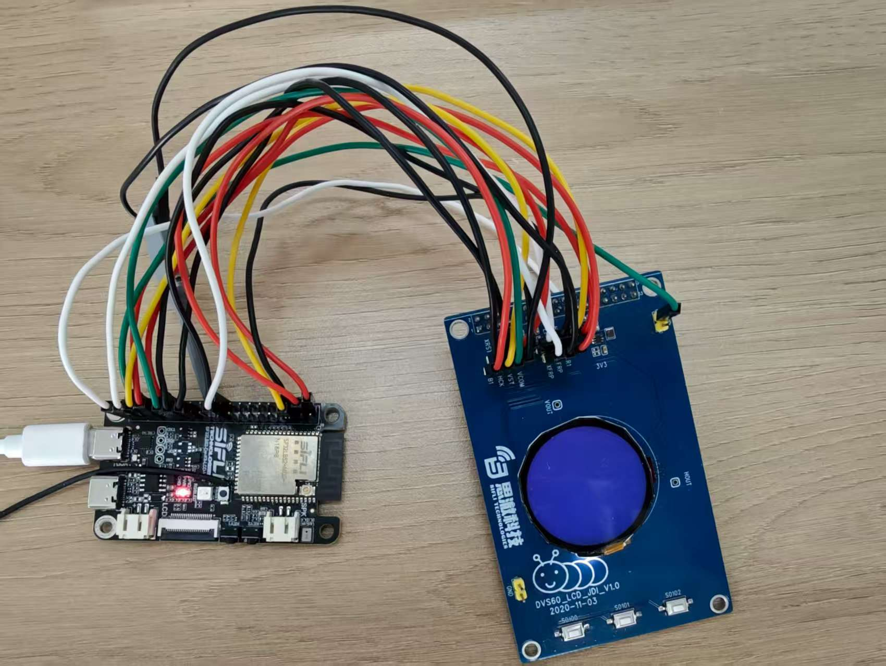

# sf32lb52x与JDI屏硬件连接介绍

## 概述

JDI屏幕添加屏驱的方法与普通屏幕一致[添加新的屏幕]（https://wiki.sifli.com/tools/%E5%B1%8F%E5%B9%95%E6%A8%A1%E7%BB%84%E8%B0%83%E8%AF%95.html） 

JDI的屏幕驱动可以参考SDK现有的屏驱，menuconfig选项“1.2 round JDI387A LCD”，屏驱文件是`jdi387a.c`.  
## 硬件连接
* 有关sf32lb52x开发板与JDI屏幕引脚匹配

|PA引脚|LB52X物理引脚|jdi屏幕功能引脚|
|:---|:---|:---|
|PA02	|36	     |B2|
|PA03	|40	     |B1|
|PA04	|38	     |G1|
|PA05	|12	     |R1|
|PA06	|35	     |HST|
|PA07     |22	     |ENB|
|PA08	|11	     |VST|
|PA39	|15	     |VCK|
|PA40	|13	     |XRST|
|PA41	|5	     |HCK|
|PA42	|3	     |R2|
|PA43	|7	     |G2|
|PA24	|19	     |FRP|
|PA25	|21	     |XFRP|
|PA24	|19	     |VCOM|
|VCC      |1        |VCC|
|GND      |6        |GND|

## 连线演示
这里不是`sf32lb52-lcd_n16r8_jdi`板子，是拿`sf32lb52-lcd_n16r8`开发板进行飞线连接用来演示如下图：

## 更新记录
|版本 |日期   |发布说明 |
|:---|:---|:---|
|0.0.1 |07/2025 |初始版本 |
| | | |
| | | |
