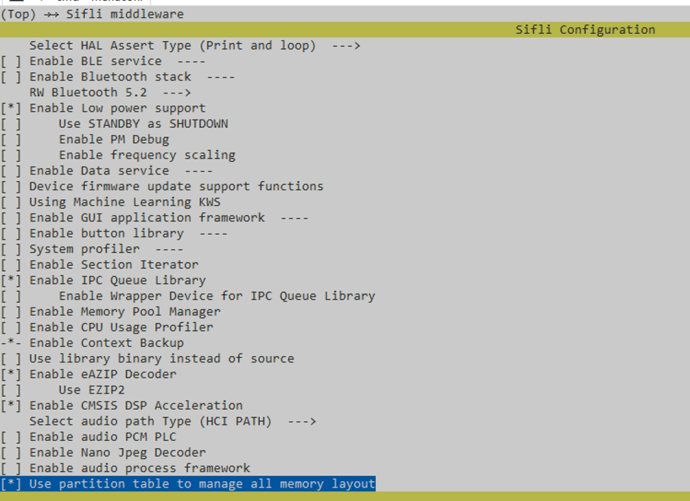
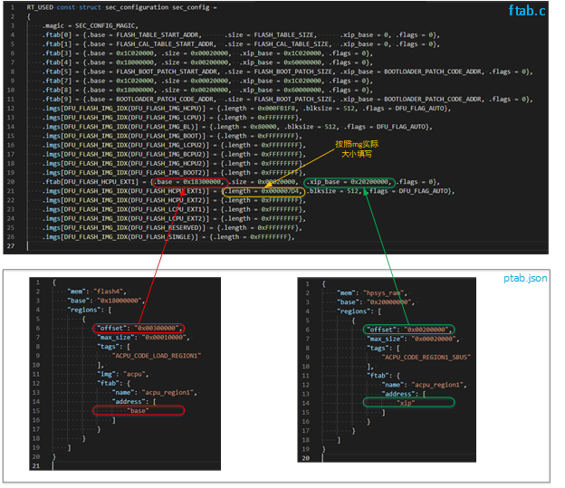

# Partition Table

The `partition_table` module is a build script tool that parses the partition table description file `ptab.json` and generates the header file `ptab.h`. This header file contains a series of macro definitions related to partition information, which can be included in projects to obtain partition details.

The partition table can describe the address mapping for all memory types, including NOR Flash, NAND Flash, eMMC, TF cards, PSRAM, and on-chip SRAM. Each board has its own `ptab.json` that describes the partition information for that board. Any project compiled for that board must follow the address mapping defined by the partition table. Projects can also use a custom `ptab.json` to override the board’s default configuration.

## Enabling the Partition Table

Select `Use partition table to manage all memory layout` in the middleware to enable the partition table feature:


You also need to define the following switch in your project’s `Kconfig.proj`. This snippet is already included in all example projects.

```kconfig
#APP specific configuration.
config CUSTOM_MEM_MAP
    bool 
	select custom_mem_map
	default y if !SOC_SIMULATOR
```

## Partition Table Syntax

The partition table description file `ptab.json` is a JSON-formatted text file that follows JSON syntax and can be edited with any text editor. The partition table uses a list to define all memory used in the system. Each element in the list corresponds to a memory block. For example, the following example includes flash5, psram1, flash4, hpsys\_ram, etc. Each memory block has the following properties:

* `mem`: The name of the memory.
* `base`: The base address of the memory, in hexadecimal. Must be correct.
* `regions`: The list of partitions within the memory.

`regions` defines the partitions within the memory. Each partition has the following properties:

* `offset`: The offset in bytes (hexadecimal).
* `max_size`: The size in bytes (hexadecimal).
* `tags`: A list of tags. Each tag is used to generate corresponding macros representing the partition’s size and starting address. For example, a tag `FLASH_BOOT_LOADER` generates `FLASH_BOOT_LOADER_START_ADDR`, `FLASH_BOOT_LOADER_OFFSET`, and `FLASH_BOOT_LOADER_SIZE` macros. `START_ADDR` is `base + offset`, `OFFSET` equals the `offset` value, and `SIZE` equals the `max_size` value.
* `ftab`: Flash table entry information (optional).
* `img`: The name of the image file stored in this partition, used to generate flashing scripts (optional).
* `exec`: The name of the program that runs on this partition (optional).
* `custom`: A custom macro dictionary (optional).


````{dropdown} ptab.json Example
```json
[
    {
        "mem": "flash5", 
        "base": "0x1C000000", 
        "regions": [
            {
                "offset": "0x00020000", 
                "max_size": "0x00020000", 
                "tags": [
                    "FLASH_BOOT_LOADER"
                ], 
                "ftab": {
                    "name": "bootloader", 
                    "address": [
                        "base", 
                        "xip"
                    ]
                }, 
                "img": "bootloader",
                "exec": "bootloader"
            }
        ]
    }, 
    {
        "mem": "psram1", 
        "base": "0x60000000", 
        "regions": [
            {
                "offset": "0x00000000", 
                "max_size": "0x00200000", 
                "tags": [], 
                "ftab": {
                    "name": "main", 
                    "address": [
                        "xip"
                    ]
                }
            }, 
            {
                "offset": "0x00200000", 
                "max_size": "0x00200000", 
                "tags": [
                    "PSRAM_DATA"
                ]
            },
        ]
    }, 
    {
        "mem": "psram1_cbus", 
        "base": "0x10000000", 
        "regions": [
            {
                "offset": "0x00000000", 
                "max_size": "0x00200000", 
                "tags": [
                    "HCPU_FLASH_CODE"
                ],
                "exec": "main"
            }
        ]
    }, 
    {
        "mem": "flash4", 
        "base": "0x18000000", 
        "regions": [
            {
                "offset": "0x00000000", 
                "max_size": "0x00200000", 
                "tags": [
                    "HCPU_FLASH_CODE_LOAD_REGION"
                ], 
                "img": "main", 
                "ftab": {
                    "name": "main", 
                    "address": [
                        "base"
                    ]
                }
            }, 
            {
                "offset": "0x00200000", 
                "max_size": "0x00100000", 
                "tags": [
                    "FS_REGION"
                ]
            }
        ]
    }, 
    {
        "mem": "hpsys_ram", 
        "base": "0x20000000", 
        "regions": [
            {
                "offset": "0x00000000", 
                "max_size": "0x0006BC00", 
                "tags": [
                    "HCPU_RAM_DATA"
                ]
            }, 
            {
                "offset": "0x0006BC00", 
                "max_size": "0x00014000", 
                "tags": [
                    "HCPU_RO_DATA"
                ]
            }, 
        ]
    }
]
```
````

### Property Details

#### ftab

The `ftab` property defines parameters for a flash table entry, generating the flash table description file `ftab.c` for compilation. The flash table affects program startup, so `ftab` must be filled correctly. `ftab` includes the following properties:
- `name`: Program name. `bootloader` means the secondary bootloader, `main` means the main program, and `dfu` means the DFU program. These are reserved system names and should not be used arbitrarily. Other names can be defined freely by the user, e.g., `acpu_region1` can represent an ACPU code partition.
- `address`: A list of address types. If the partition stores a program image, use `"base"`. If the program runs directly from the memory region, use `"xip"`. If both (i.e., the program executes in place, XIP), specify both `"base"` and `"xip"`.

Below is an example describing `bootloader` stored in flash5, with the address range `0x1C020000`~`0x1C03FFFF`. The secondary bootloader code also runs directly from flash5 (XIP).

```json
{
    "mem": "flash5", 
    "base": "0x1C000000", 
    "regions": [
        {
            "offset": "0x00020000", 
            "max_size": "0x00020000", 
            "tags": [
                "FLASH_BOOT_LOADER"
            ], 
            "ftab": {
                "name": "bootloader", 
                "address": [
                    "base", 
                    "xip"
                ]
            }, 
            "img": "bootloader",
            "exec": "bootloader"
        }
    ]
}, 
```

Programs that are not reserved system programs (`name` is not `main`, `bootloader`, or `dfu`) use the following flash table entries to describe stored image info in sequence:
- DFU_FLASH_HCPU_EXT2: 11
- DFU_FLASH_LCPU_EXT1: 12
- DFU_FLASH_LCPU_EXT2: 13

For example, the following `ptab.json` snippet defines `acpu_region1` using flash4 offset `0x00300000` as the ACPU program’s base address and hpsys_ram offset `0x00200000` as the XIP address. The generated `ftab.c` file uses `DFU_FLASH_HCPU_EXT2` to describe the image storage and execution addresses, with `length` determined by the program image file (example: 0x7d4 bytes) that is specified by `img` property (see [](#img) for details)

````{dropdown} acpu_region1 Example
```json
{
    "mem": "flash4", 
    "base": "0x18000000", 
    "regions": [
        {
            "offset": "0x00300000", 
            "max_size": "0x00010000", 
            "tags": [
                "ACPU_CODE_LOAD_REGION1"
            ], 
            "img": "acpu", 
            "ftab": {
                "name": "acpu_region1", 
                "address": [
                    "base"
                ]
            }
        }
    ]
}, 
{
    "mem": "hpsys_ram", 
    "base": "0x20000000", 
    "regions": [
        {
            "offset": "0x00200000", 
            "max_size": "0x00020000", 
            "tags": [
                "ACPU_CODE_REGION1_SBUS"
            ], 
            "ftab": {
                "name": "acpu_region1", 
                "address": [
                    "xip"
                ]
            }
        }
    ]
}, 
```
````

The `ftab.c` generated from this example is as follows:

```{code-block} c
:lineno-start: 1
:emphasize-lines: 20,21

RT_USED const struct sec_configuration sec_config =
{
    .magic = SEC_CONFIG_MAGIC,
    .ftab[0] = {.base = FLASH_TABLE_START_ADDR,      .size = FLASH_TABLE_SIZE,      .xip_base = 0, .flags = 0},
    .ftab[1] = {.base = FLASH_CAL_TABLE_START_ADDR,  .size = FLASH_CAL_TABLE_SIZE,  .xip_base = 0, .flags = 0},
    .ftab[3] = {.base = 0x1C020000, .size = 0x00020000,  .xip_base = 0x1C020000, .flags = 0},
    .ftab[4] = {.base = 0x18000000, .size = 0x00200000,  .xip_base = 0x60000000, .flags = 0},
    .ftab[5] = {.base = FLASH_BOOT_PATCH_START_ADDR, .size = FLASH_BOOT_PATCH_SIZE, .xip_base = BOOTLOADER_PATCH_CODE_ADDR, .flags = 0},
    .ftab[7] = {.base = 0x1C020000, .size = 0x00020000,  .xip_base = 0x1C020000, .flags = 0},
    .ftab[8] = {.base = 0x18000000, .size = 0x00200000,  .xip_base = 0x60000000, .flags = 0},
    .ftab[9] = {.base = BOOTLOADER_PATCH_CODE_ADDR,  .size = FLASH_BOOT_PATCH_SIZE, .xip_base = BOOTLOADER_PATCH_CODE_ADDR, .flags = 0},
    .imgs[DFU_FLASH_IMG_IDX(DFU_FLASH_IMG_HCPU)] = {.length = 0x000FB1F8, .blksize = 512, .flags = DFU_FLAG_AUTO},
    .imgs[DFU_FLASH_IMG_IDX(DFU_FLASH_IMG_LCPU)] = {.length = 0xFFFFFFFF},
    .imgs[DFU_FLASH_IMG_IDX(DFU_FLASH_IMG_BL)] = {.length = 0x80000, .blksize = 512, .flags = DFU_FLAG_AUTO},
    .imgs[DFU_FLASH_IMG_IDX(DFU_FLASH_IMG_BOOT)] = {.length = 0xFFFFFFFF},
    .imgs[DFU_FLASH_IMG_IDX(DFU_FLASH_IMG_LCPU2)] = {.length = 0xFFFFFFFF},
    .imgs[DFU_FLASH_IMG_IDX(DFU_FLASH_IMG_BCPU2)] = {.length = 0xFFFFFFFF},
    .imgs[DFU_FLASH_IMG_IDX(DFU_FLASH_IMG_HCPU2)] = {.length = 0xFFFFFFFF},
    .imgs[DFU_FLASH_IMG_IDX(DFU_FLASH_IMG_BOOT2)] = {.length = 0xFFFFFFFF},
    .ftab[DFU_FLASH_HCPU_EXT2] = {.base = 0x18300000, .size = 0x00020000,  .xip_base = 0x20200000, .flags = 0},
    .imgs[DFU_FLASH_IMG_IDX(DFU_FLASH_HCPU_EXT2)] = {.length = 0x000007D4, .blksize = 512, .flags = DFU_FLAG_AUTO},
    .imgs[DFU_FLASH_IMG_IDX(DFU_FLASH_LCPU_EXT1)] = {.length = 0xFFFFFFFF},
    .imgs[DFU_FLASH_IMG_IDX(DFU_FLASH_LCPU_EXT2)] = {.length = 0xFFFFFFFF},
    .imgs[DFU_FLASH_IMG_IDX(DFU_FLASH_RESERVED)] = {.length = 0xFFFFFFFF},
    .imgs[DFU_FLASH_IMG_IDX(DFU_FLASH_SINGLE)] = {.length = 0xFFFFFFFF},
    .running_imgs[CORE_HCPU] = (struct image_header_enc *) &sec_config.imgs[DFU_FLASH_IMG_IDX(DFU_FLASH_IMG_HCPU)],
    .running_imgs[CORE_LCPU] = (struct image_header_enc *)0xFFFFFFFF,
    .running_imgs[CORE_BL] = (struct image_header_enc *) &sec_config.imgs[DFU_FLASH_IMG_IDX(DFU_FLASH_IMG_BL)],
    .running_imgs[CORE_BOOT] = (struct image_header_enc *)0xFFFFFFFF,
};
```

The following diagram shows how the storage and execution addresses for the ACPU program in `ftab.c` are extracted from `ptab.json`.



#### img

The `img` property specifies the program image file stored in a partition. The flashing script uses this to determine the flash address. If the `ftab` `base` and `xip` addresses are the same, `img` is unnecessary because the hex file already contains the address info for flashing.

Example:

```json
{
    "mem": "flash4", 
    "base": "0x18000000", 
    "regions": [
        {
            "offset": "0x00000000", 
            "max_size": "0x00200000", 
            "tags": [
                "HCPU_FLASH_CODE_LOAD_REGION"
            ], 
            "img": "main", 
            "ftab": {
                "name": "main", 
                "address": [
                    "base"
                ]
            }
        }
    ]
}, 
{
    "mem": "psram1", 
    "base": "0x60000000", 
    "regions": [
        {
            "offset": "0x00000000", 
            "max_size": "0x00200000", 
            "tags": [], 
            "ftab": {
                "name": "main", 
                "address": [
                    "xip"
                ]
            }
        }
    ]
}, 
{
    "mem": "psram1_cbus", 
    "base": "0x10000000", 
    "regions": [
        {
            "offset": "0x00000000", 
            "max_size": "0x00200000", 
            "tags": [
                "HCPU_FLASH_CODE"
            ],
            "exec": "main"
        }
    ]
}, 
```

The specified image name must match the binary generated by the project. If only one binary is generated, you can omit the `.bin` extension and name it simply `main`, `bootloader`, or `lcpu`. If there are multiple files, use the format `proj_name:binary_name`. For example, if `acpu` is added as a sub-project, its binaries `ER_IROM1.bin` and `ER_IROM2.bin` can be specified as `acpu:ER_IROM1.bin` and `acpu:ER_IROM2.bin`.

#### exec

The `exec` property specifies the name of the executable program stored in a partition. It allows the same linker script to be reused for building the main and sub-programs like bootloader, DFU, and main. For example, `CODE_START_ADDR` is specified by `ptab.h` based on the partition.

When building the bootloader:

```c
#undef  FLASH_BOOT_LOADER_START_ADDR
#define FLASH_BOOT_LOADER_START_ADDR (0x1C020000)
#undef  FLASH_BOOT_LOADER_SIZE
#define FLASH_BOOT_LOADER_SIZE (0x00020000)
#undef  FLASH_BOOT_LOADER_OFFSET
#define FLASH_BOOT_LOADER_OFFSET (0x00020000)
#define CODE_START_ADDR (FLASH_BOOT_LOADER_START_ADDR)
#define CODE_SIZE (FLASH_BOOT_LOADER_SIZE)
```

When building the main program:

```c
#undef  HCPU_FLASH_CODE_START_ADDR
#define HCPU_FLASH_CODE_START_ADDR (0x10000000)
#undef  HCPU_FLASH_CODE_SIZE
#define HCPU_FLASH_CODE_SIZE (0x00200000)
#undef  HCPU_FLASH_CODE_OFFSET
#define HCPU_FLASH_CODE_OFFSET (0x00000000)
#define CODE_START_ADDR (HCPU_FLASH_CODE_START_ADDR)
#define CODE_SIZE (HCPU_FLASH_CODE_SIZE)
```

```{note}
Note: For PSRAM partitions, CBUS and SBUS are two address spaces. For example, CBUS address is `0x10000000` and SBUS is `0x60000000`. The `exec` property must be specified for the CBUS partition to ensure the execution address uses CBUS space, while `ftab` `"xip"` must be specified for the SBUS partition to ensure the code is copied there.
```

#### custom

The `custom` property allows adding custom macros to `ptab.h`. The value must be a dictionary. For example:

```json
"custom": {
    "PSRAM_BL_MODE": 3, 
    "PSRAM_BL_SIZE": 8, 
    "PSRAM_BL_MPI": 2
}
```

Generates:

```c
#define PSRAM_BL_MODE  (3)
#define PSRAM_BL_SIZE  (8)
#define PSRAM_BL_MPI   (1)
```

```{note}
Note: Dictionary values must be integers.
```

