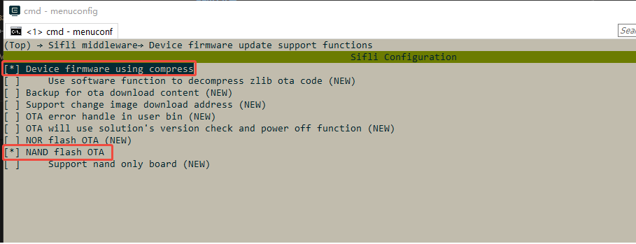
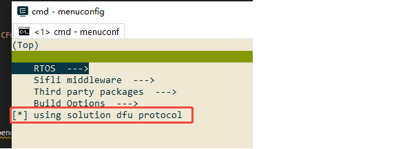
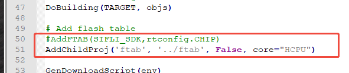
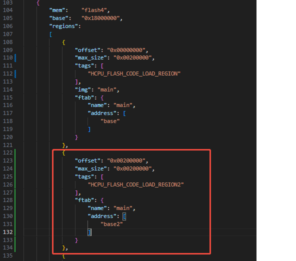
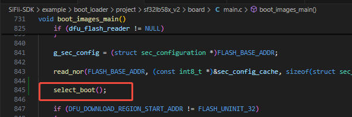
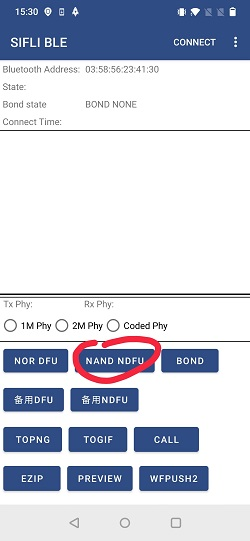
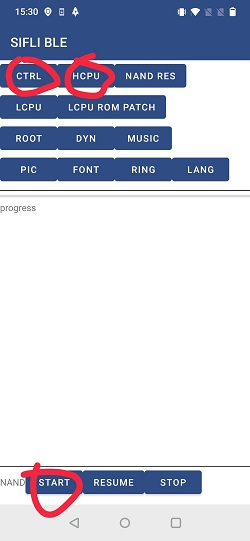

# BLE central and peripheral with pingpong ota示例

源码路径：example/ble/central_and_peripheral_with_pingpong_ota

(Platform_cen_peri)=
## 支持的平台
<!-- 支持哪些板子和芯片平台 -->
flash table烧录在mpi5的工程

## 概述
<!-- 例程简介 -->
本例程演示了本平台如何同时做GAP central和peripheral以及GATT的client及server。
以及如何通过pingpong的方式对该工程进行升级


## 例程的使用
<!-- 说明如何使用例程，比如连接哪些硬件管脚观察波形，编译和烧写可以引用相关文档。
对于rt_device的例程，还需要把本例程用到的配置开关列出来，比如PWM例程用到了PWM1，需要在onchip菜单里使能PWM1 -->
1. 本例程的Finsh命令可以通过输入diss help来打印命令及使用方法。
2. 作为从设备时开机会开启广播，广播名字以SIFLI_APP-xx-xx-xx-xx-xx-xx, 其中xx代表本设备的蓝牙地址。可以通过手机的BLE APP进行连接
3. 作为主设备时，可以通过finsh命令搜索其他从设备，并发起连接。
4. 作为GATT server时，可以在手机端进行write和read操作，或者使能CCCD，设备会每一秒更新一次特征值。
5. 作为GATT client时，可以通过finsh命令搜索server的database并显示，并对特征值进行读或写的操作。
6. 通过SIFLE BLE APP连接板子，选择文件后可以升级


### 硬件需求
运行该例程前，需要准备：
+ 一块本例程支持的开发板（[支持的平台](#Platform_cen_peri)）。
+ 手机设备。

### menuconfig配置
1. 使能蓝牙(`BLUETOOTH`)：\

2. 使能GAP, GATT Client, BLE connection manager：\

3. 使能NVDS：\

4. 使能pingpong ota相关的内容：\

5. 打开solution ota的宏： \


### 其他接入相关注意事项
1. SConstruct
FTAB需要通过addchildproj的方式添加 \


2. ptab.json
需要划分一个和HCPU_FLASH_CODE_LOAD_REGION一样大小的main, base2区域，作为pong区域 \


3. boot loader
需要添加跳转的逻辑，具体可以查看本例程的一系列实现 \


4. 制作命令
```c
.\imgtoolv37.exe gen_dfu --img_para main 0 0 --key=s01 --sigkey=sig --dfu_id=1 --hw_ver=51 --sdk_ver=7001 --fw_ver=1001001 --com_type=0 --bksize=2048 --align=0
```
main待升级的bin的名字，如果是hcpu.bin 则填hcpu即可。
Bin名字后面的第一个参数用于压缩，16是使用压缩，0是不压缩。只能选择不压缩
Bin名字后面的第二个参数表示image id，hcpu是0，可以同时制作多个bin
然后要自行实现后续bin，是存放到备份区域，最后再安装，还是直接覆盖目标地址

5. 手机操作
操作如下图示意，搜索板子的BLE广播，点击对应设备，然后选择nand dfu，先选ctrl文件，然后选择hcpu为刚才制作的outmain.bin，最后点击start按钮 \




### 编译和烧录
切换到例程project目录，运行scons命令执行编译：
```c
> scons --board=sf32lb58-lcd_n16r64n4 -j8
```
切换到例程`project/build_xx`目录，运行`uart_download.bat`，按提示选择端口即可进行下载：
```c
$ ./uart_download.bat

     Uart Download

please input the serial port num:5
```
关于编译、下载的详细步骤，请参考[快速入门](/quickstart/get-started-gcc.md)的相关介绍。

## 例程的预期结果
<!-- 说明例程运行结果，比如哪几个灯会亮，会打印哪些log，以便用户判断例程是否正常运行，运行结果可以结合代码分步骤说明 -->
例程启动后：
1. 可以被手机BLE APP搜到并连接，进行相应的GATT特质值read/write等操作。
2. 可以搜索其他BLE设备，并连接和搜索连接上设备的GATT database，同时可以进行GATT read/write等操作。
3. 可以用APP完成升级

## 异常诊断


## 参考文档
<!-- 对于rt_device的示例，rt-thread官网文档提供的较详细说明，可以在这里添加网页链接，例如，参考RT-Thread的[RTC文档](https://www.rt-thread.org/document/site/#/rt-thread-version/rt-thread-standard/programming-manual/device/rtc/rtc) -->

## 更新记录
|版本 |日期   |发布说明 |
|:---|:---|:---|
|0.0.1 |07/2025 |初始版本 |
| | | |
| | | |
