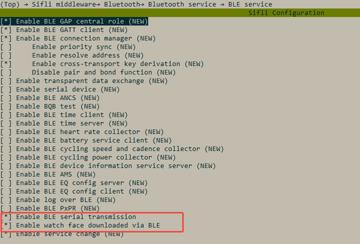
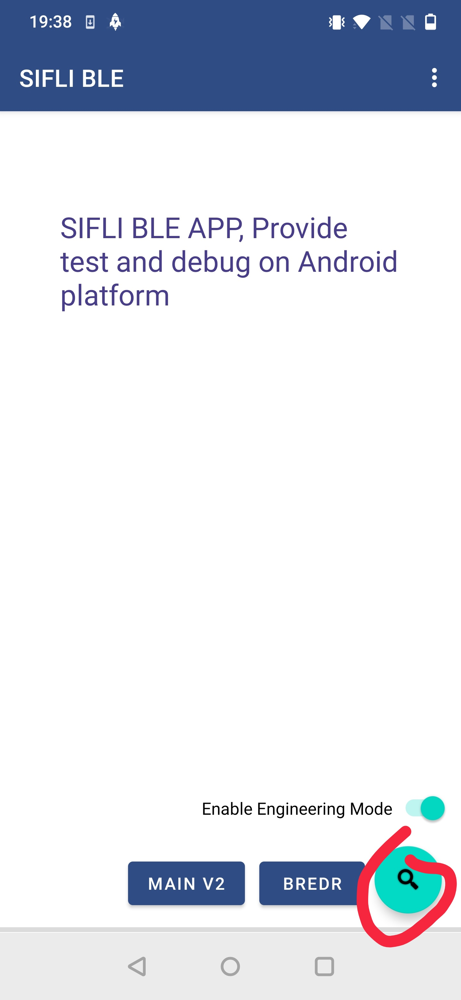
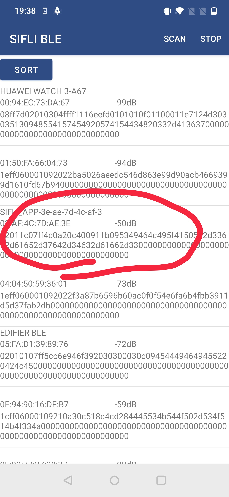
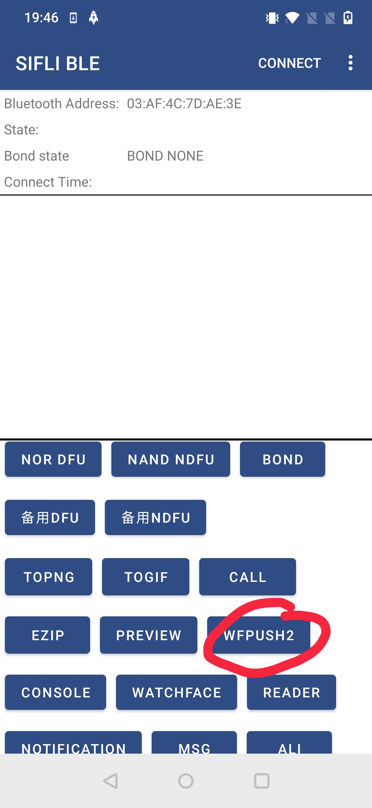
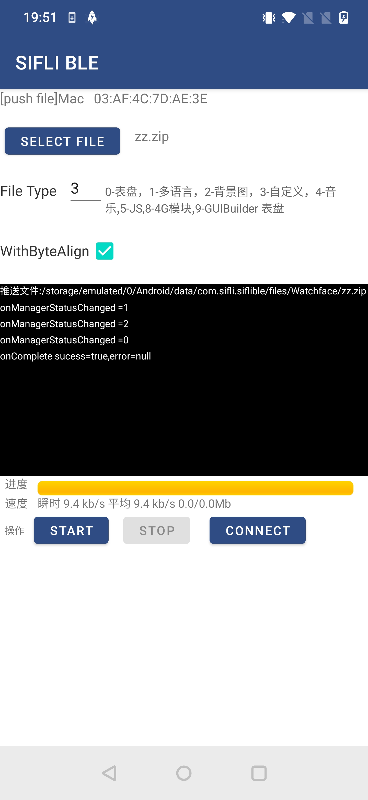

# BLE file transfer示例

源码路径：example/ble/file_transfer

(Platform_file_rec)=
## 支持的平台
<!-- 支持哪些板子和芯片平台 -->
全平台

## 概述
<!-- 例程简介 -->
本例程演示了本平台如何做GAP peripheral然后接收手机端发送的文件

## 例程的使用
<!-- 说明如何使用例程，比如连接哪些硬件管脚观察波形，编译和烧写可以引用相关文档。
对于rt_device的例程，还需要把本例程用到的配置开关列出来，比如PWM例程用到了PWM1，需要在onchip菜单里使能PWM1 -->
1. 本例程的Finsh命令可以通过输入diss help来打印命令及使用方法。
2. 作为从设备时开机会开启广播，广播名字以SIFLI_APP-xx-xx-xx-xx-xx-xx, 其中xx代表本设备的蓝牙地址。可以通过手机的BLE APP进行连接
3. 可以使用sifli ble serial transport串行传输协议，从手机端发送文件到设备端，一次可以发送一个或者多个文件。


### 硬件需求
运行该例程前，需要准备：
+ 一块本例程支持的开发板（[支持的平台](#Platform_file_rec)）。
+ 手机设备。

### menuconfig配置
1. 使能蓝牙(`BLUETOOTH`)：\

2. 使能GAP, GATT Client, BLE connection manager：\

3. 使能NVDS：\

4. 打开传输相关的宏：\


### 编译和烧录
切换到例程project/common目录，运行scons命令执行编译：
```c
> scons --board=eh-lb525 -j32
```
切换到例程`project/common/build_xx`目录，运行`uart_download.bat`，按提示选择端口即可进行下载：
```c
$ ./uart_download.bat

     Uart Download

please input the serial port num:5
```
关于编译、下载的详细步骤，请参考[快速入门](/quickstart/get-started.md)的相关介绍。

## 例程的预期结果
<!-- 说明例程运行结果，比如哪几个灯会亮，会打印哪些log，以便用户判断例程是否正常运行，运行结果可以结合代码分步骤说明 -->
例程启动后：
1. 可以被手机BLE APP搜到并连接。
2. 将需要传输的一个或者多个文件，使用zip格式进行压缩，压缩后只有一个.zip文件，将该文件传入手机
3. 使用SIFLI BLE APP搜索，连接该设备，然后再watchface界面，选择自定义文件，然后选择该文件，该文件就可以传输到手机
4. 手机使用步骤 \




5. 传输界面 \
file tpye填3，自定义文件 \
withByteAlign需要勾选 \
后续开发可以自行定义各种类型的不同处理


## 手机SDK接入说明
https://github.com/OpenSiFli/SiFli_OTA_APP
SiFli-SDK file transfer

## 异常诊断
当开发板回复某个异常错误时，检查bf0_sibles_watchface.h中的ble_watchface_status_id_t

## 参考文档
<!-- 对于rt_device的示例，rt-thread官网文档提供的较详细说明，可以在这里添加网页链接，例如，参考RT-Thread的[RTC文档](https://www.rt-thread.org/document/site/#/rt-thread-version/rt-thread-standard/programming-manual/device/rtc/rtc) -->

## 更新记录
|版本 |日期   |发布说明 |
|:---|:---|:---|
|0.0.1 |07/2025 |初始版本 |
| | | |
| | | |
