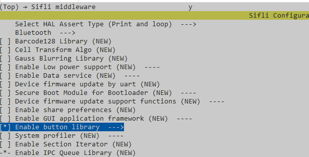

# BLE hid示例

源码路径：example/ble/hid

(Platform_hid)=
## 支持的平台
<!-- 支持哪些板子和芯片平台 -->
全平台

## 概述
<!-- 例程简介 -->
1. 本例程演示了本平台如何实现BLE HID。
2. 例程中实现了两类HID type，分把是HID_KEYBOARD和HID_CONSUMER。
    1) main.c默认定义了HID_KEYBOARD，可以通过undefine HID_KEYBOARD再define HID_CONSUMER方式来切换编译后支持的type。
    


## 例程的使用
<!-- 说明如何使用例程，比如连接哪些硬件管脚观察波形，编译和烧写可以引用相关文档。
对于rt_device的例程，还需要把本例程用到的配置开关列出来，比如PWM例程用到了PWM1，需要在onchip菜单里使能PWM1 -->
1. 本例程开机会开启广播，广播名字以SIFLI_APP-xx-xx-xx-xx-xx-xx, 其中xx代表本设备的蓝牙地址。可以通过Windows，Mac的蓝牙直接连接
2. 编译烧录之后，可以在PC端找到并连接，连接成功之后就可以通过开发板按键进行输入，PC端就看到相应的输出，短按时输出'a'，长按时一直输出'aaaaaa...'  
* 如果PC端有串口工具就可以通过Finsh命令发送"test_hids 4 p"命令，在PC端就可以输出"a","test_hids 4 r"停止输出。     
* 可以更改键盘的功能，比如将'a',设置为'b',直接更改代码中的0x04,改为0x05（这里可以在网上查找相关的HID按键映射表）。
注意：修改代码重新编译烧录之后，PC端需要先删除之前连接的设备，重新连接。
```c
static key_mapping_t key_mapping_table[1] = {
    {0x01, 0x04}        // HID keycode for 'a'
};
```
* 可以增加按键的数量，每个按键对应不同的功能。如下代码添加映射表，修改按键初始化函数。
```c
static key_mapping_t key_mapping_table[2] = {
    {0x01, 0x04},        // HID keycode for 'a'
    {0x01, 0x05}        // HID keycode for 'b'
    //
};

static void key_button_handler(int pin, button_action_t action)
{
    uint8_t hid_code = 0;
    uint8_t key_idx = 0;
    
    if (pin == BSP_KEY1_PIN) {
        key_idx = 0;  
    } else if (pin == BSP_KEY2_PIN) {
        key_idx = 1;  
    } else {
        LOG_W("Unknown button pin: %d", pin);
        return;
    }
    hid_code = key_mapping_table[key_idx].hid_code;
    switch (action)
    {
    case BUTTON_PRESSED:
        HID_KEY_SET(hid_code);
        HID_KEY_SEND();
        break;
    case BUTTON_RELEASED:
        HID_KEY_CLEAR(hid_code);
        HID_KEY_SEND();
        break;
    default:
        break;
    }
}
static void key_button_init(void)
{
    button_cfg_t key1_cfg = {
        .pin = BSP_KEY1_PIN,
        .mode = PIN_MODE_INPUT_PULLUP,
        .active_state = BUTTON_ACTIVE_HIGH,
        .button_handler = key_button_handler,
    };
    int key1_id = button_init(&key1_cfg);
    if (key1_id >= 0)button_enable(key1_id);

    button_cfg_t key2_cfg = {
        .pin = BSP_KEY2_PIN,
        .mode = PIN_MODE_INPUT_PULLUP,
        .active_state = BUTTON_ACTIVE_HIGH,
        .button_handler = key_button_handler,
    };
    int key2_id = button_init(&key2_cfg);
    if (key2_id >= 0)button_enable(key2_id);
}
```
3. 连上PC设备后，通过串口助手发送finsh命令"test_hids [key] [p|r]"向PC端发起控制命令。其中p|r代表press|release, 需要配对使用；key根据HID type是keyboard还是consumer有不同值：
    1) Keyboard type的key取值范围：\
    
    2) Consumer type的key取值范围: \
    
    3) 比如再consume type下输入"test_hids 0 p"就代表输入key值对应PLAY的press操作。
### 硬件需求
运行该例程前，需要准备：
+ 一块本例程支持的开发板([支持的平台](#Platform_hid))。
+ 手机设备。

### menuconfig配置
1. 使能蓝牙(`BLUETOOTH`)：\

2. 使能GAP, GATT Client, BLE connection manager：\

3. 使能NVDS：\

4. 使能按键：\
   


### 编译和烧录
切换到例程project目录，运行scons命令执行编译：
```c
> scons --board=eh-lb525 -j32
```
切换到例程`project/build_xx`目录，运行`uart_download.bat`，按提示选择端口即可进行下载：
```c
$ ./uart_download.bat

     Uart Download

please input the serial port num:5
```
关于编译、下载的详细步骤，请参考[快速入门](/quickstart/get-started.md)的相关介绍。

## 例程的预期结果
<!-- 说明例程运行结果，比如哪几个灯会亮，会打印哪些log，以便用户判断例程是否正常运行，运行结果可以结合代码分步骤说明 -->
例程启动后：
1. 可以被手机的BLE APP搜到并连上。
2. 通过finsh命令可以对手机进行控制。

## 异常诊断


## 参考文档
<!-- 对于rt_device的示例，rt-thread官网文档提供的较详细说明，可以在这里添加网页链接，例如，参考RT-Thread的[RTC文档](https://www.rt-thread.org/document/site/#/rt-thread-version/rt-thread-standard/programming-manual/device/rtc/rtc) -->

## 更新记录
|版本 |日期   |发布说明 |
|:---|:---|:---|
|0.0.1 |01/2025 |初始版本 |
| | | |
| | | |
