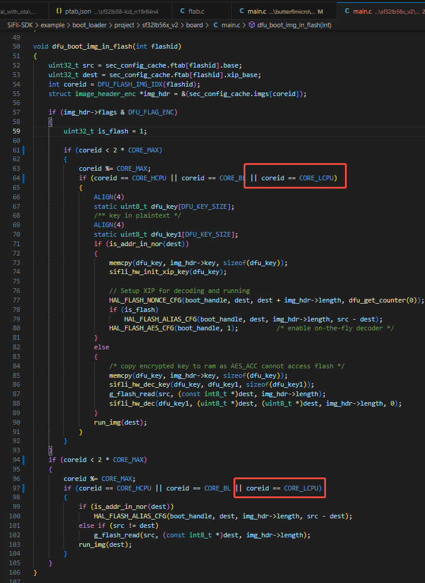

# peripheral_with_ota Example Description and SDK DFU Integration

## Supported Platforms
52x, 56x and 58x chips

## Overview
<!-- Example introduction -->
This example demonstrates adding DFU functionality based on a BLE peripheral project as the main project.
1. The minimum upgrade unit is the .bin file generated by project compilation. The files to be upgraded can be one or multiple files, which are compressed and packaged into an upgrade package through specific scripts.
2. You can use the mobile APP provided by Sifli or integrate the mobile SDK to download in the system's main project (also referred to as hcpu.bin), transfer the upgrade package to the system's upgrade backup area, or choose to transfer it yourself and then call the installation interface.
3. After calling the installation interface, the system will first check if the upgrade package contains dfu.bin. If it does, dfu.bin will be updated first.
4. After updating dfu.bin or if dfu.bin is not included, the system will restart and run the content of dfu.bin.
5. In dfu.bin, all bins except dfu.bin in the upgrade package will be extracted and installed to the corresponding areas. After installation is complete, it will restart again, enter hcpu.bin after restart, and the upgrade is complete.

## Example Usage
1. The main project of this example is the same as BLE peripheral. For usage of this project, please refer to the example/ble/peripheral project.
2. The tools for creating upgrade packages (ezip.exe, img_toolv37.exe) are in the tool/secureboot directory, and key-related content is in the tool/secureboot/sifli02 directory. Put the above files in the same directory and create the upgrade package according to the package creation section below.
3. Download the upgrade package through BLE APP, or download to the DFU_DOWNLOAD_REGION area via uart/jlink.
4. If using Sifli BLE app for download, it will automatically install and restart. If downloading manually, you need to call dfu_offline_install_set_v2, then call HAL_PMU_ReBoot to restart.
5. After restart, the main program in the upgrade package will run.

### menuconfig Configuration
See Integration Method - Main Project

### Compilation and Flashing
Navigate to the example project directory and run the scons command to compile:
```c
> scons --board=eh-lb561 -j8
```
Navigate to the example's `project/build_xx` directory, run `uart_download.bat`, and select the port as prompted to download:
```c
$ ./uart_download.bat

     Uart Download

please input the serial port num:5
```
For detailed steps on compilation and downloading, please refer to the relevant section in the [Quick Start Guide](/quickstart/get-started.md).

## Integration Method
This project has already been configured with the following content. If you need to integrate DFU sub project into your own project, you need to check as follows:

### ptab.json
Need to configure DFU_FLASH_CODE and DFU_DOWNLOAD_REGION areas.
DFU_FLASH_CODE is the area for dfu.bin, recommended size is 384KB
DFU_DOWNLOAD_REGION is the space for storing downloaded files, need to reserve space of all files' size * 0.7 for one upgrade


For NAND projects, the following additional modifications are needed when modifying ptab:
1. Move the HCPU_FLASH_CODE macro to the hcpu tags in flash2
2. Add DFU_DOWNLOAD_REGION
3. Additionally add a DFU_INFO_REGION, 128KB

4. Add xip information for dfu partition
5. In psram1_cbus HCPU area, change HCPU_FLASH_CODE in tags to HCPU_PSRAM_CODE
6. Add DFU area to psram1_cbus, fill in DFU_PSRAM_CODE for tags


### Boot loader
Check if the corresponding boot loader's main.c has the logic for selecting running_imgs[CORE_HCPU]. If not, add it manually


Also, in the void dfu_boot_img_in_flash(int flashid) function in main.c, both places that check core id need to be OR'd with CORE_LCPU


### Main Project
Kconfig.proj
Add DFU switch


proj.conf
Enable DFU-related code and DFU switch


Sconstruct
Add DFU sub-project
Note: Need to add before AddFTAB


### DFU Project
Usually no modification needed

## Transmission
If transmitting manually, you need to download the packaged file to DFU_DOWNLOAD_REGION

If using the mobile transmission lib provided by Sifli to transmit this upgrade package, you need to enable the following options in the main project


Add the following content in the code


## Creating Upgrade Package
.\imgtoolv37.exe gen_dfu --img_para hcpu 16 0 dfu 16 6 --com_type=0 --offline_img=2

Put all files and the upgrade files to be created in the same directory
The command above creates both hcpu and dfu simultaneously, where hcpu represents creating hcpu.bin, dfu represents creating dfu.bin
The first parameter after the bin name is for compression, 16 means use compression, 0 means no compression
The second parameter after the bin name represents image id, hcpu is 0, dfu is 6.

The number of files to be created can be adjusted arbitrarily. You can upgrade only HCPU, or create multiple bins simultaneously. If dfu.bin is created, the DFU installer will be updated before upgrading.

After creation, only offline_install.bin needs to be transmitted

If you need to upgrade bins other than HCPU and DFU, you need to specify the flash address corresponding to the image id. In dfu_get_download_addr_by_id in dfu_flash.c, add the new ID, then return the address defined in ptab.c. The address under the flag&DFU_FLAG_COMPRESS condition does not need to be implemented.


## Mobile App Usage
The operation is shown in the following figures. Search for the board's BLE broadcast, click on the corresponding device, then select nor dfu, and finally select offline. No need to click the start button below


## Troubleshooting
1. DFU project shows insufficient space during compilation
Content enabled in board.conf will also be compiled in the dfu project, causing the dfu project to compile unnecessary things, and the size may exceed the DFU_FLASH_CODE size in ptab.json.
For content defined in board.conf that doesn't need to be compiled into the dfu project, modify proj.conf under the dfu project to define the corresponding items as n


2. DFU_DOWNLOAD_REGION size related
Note: Image resources are already compressed, so the DFU script can hardly compress them further, so calculate with * 1.0
For example, if the maximum upgrade design is to simultaneously upgrade hcpu.bin + res.bin + dfu.bin, where res.bin is image resources
Then you need to reserve space of maximum hcpu.bin size * 0.7 + res.bin size + dfu.bin size * 0.7

## Reference Documentation
<!-- For rt_device examples, the RT-Thread official documentation provides detailed explanations. You can add web links here, for example, refer to RT-Thread's [RTC Documentation](https://www.rt-thread.org/document/site/#/rt-thread-version/rt-thread-standard/programming-manual/device/rtc/rtc) -->

## Update History
|Version |Date   |Release Notes |
|:---|:---|:---|
|0.0.1 |01/2025 |Initial version|
|0.0.2 |03/2025 |Added support for NAND chip DFU, updated creation commands and scripts, removed invalid parameters|
|0.0.3 |03/2025 |Added support for 58x |
|0.0.4 |04/2025 |Added HTTP download example, adjusted directory structure and macro switches |