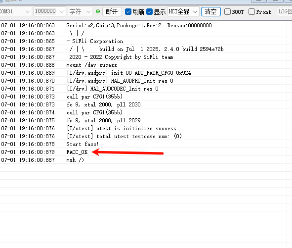
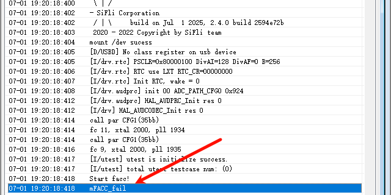

# FACC 示例
源码路径：example/hal/facc

## 支持的平台
例程可以运行在以下开发板.
* sf32lb56-lcd_n16r12n1
* sf32lb56-lcd_a128r12n1
* sf32lb58-lcd_a128r32n1_dsi
* sf32lb58-lcd_n16r64n4
## 示例概述
* 本例程演示了如何初始化和使用一个名为FACC的硬件加速器模块，用于执行FIR（有脉冲响应）滤波操作，并验证其输出结果是否正确。

## 例程的使用

### 硬件需求
运行该例程前，需要准备一块本例程支持的开发板和USB数据线

### 编译和烧录
切换到例程project目录，运行scons命令执行编译：
```
scons --board=sf32lb58-lcd_n16r64n4 -j8
```
执行烧写命令：
```
build_sf32lb58-lcd_n16r64n4_hcpu\download.bat
```
### 例程输出结果展示
* 烧写完成后串口打印这滤波信息
*如果当log中对比结束过后打印结果为ok说明滤波成功


### 异常诊断
* 滤波异常的log信息

* 首先检查输入参数是否有误，如输入参数错误，请检查输入参数是否正确，如输入参数正确，请检查滤波器是否正常
* 用于存储滤波后的数组是否越界`uint8_t facc_output [1024];`