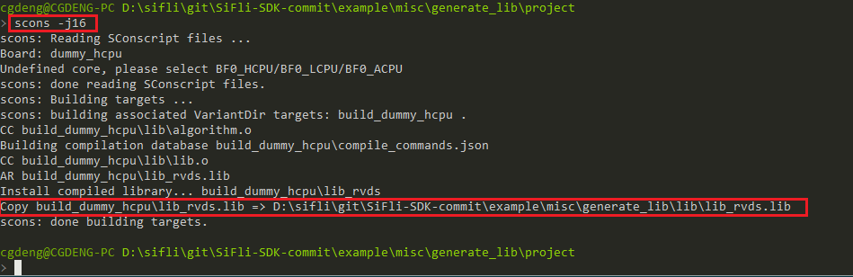
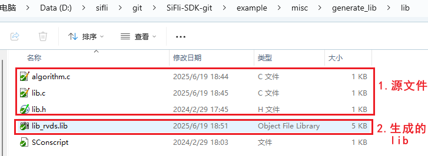
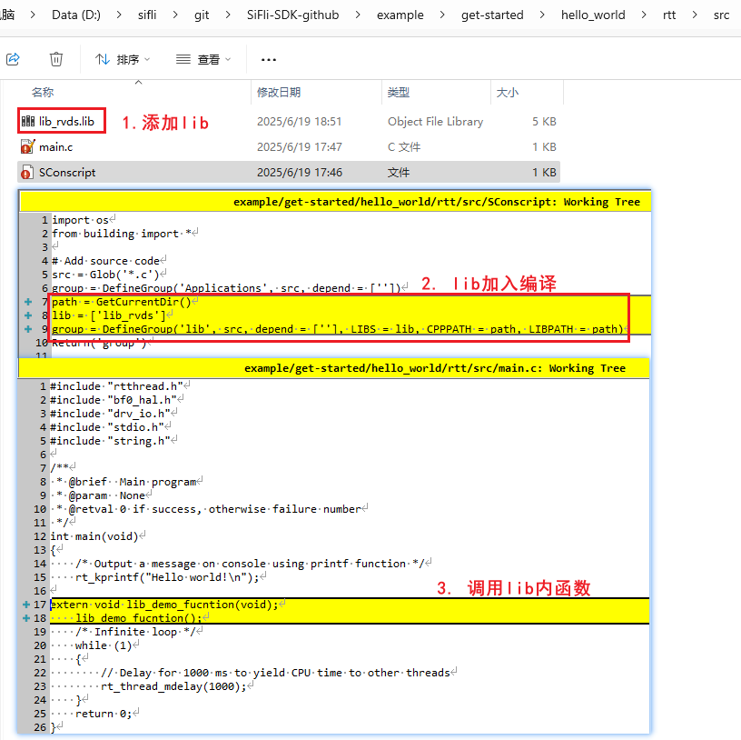

# Generate Library Example

## Supported Platforms and Build Environments
<!-- Which boards and chip platforms are supported -->
- Independent of board and which SiFli MCU series is used
- The build environment for compiling libraries depends on the build environment configuration used by normal projects
- Verified environments include KeilC and GCC

## Overview
Some customers, due to confidentiality requirements or other reasons, are unwilling to disclose source code and need to compile lib libraries for customer use, hence this example is provided.

## Compilation Method
1. Set up build environment<br>
The prerequisite for compiling lib is that normal projects can be compiled with KeilC or GCC<br>
2. Place the source files that need to be generated into lib in the `example\misc\generate_lib\lib` directory.
All source files `*.c,*.h` in this directory will be packaged and compiled into a lib_rvds.lib file
3. Compile lib<br>
Switch to the example `example\misc\generate_lib\project` directory and run the scons command to execute compilation:<br>
```
scons -j16
```
Where the parameter `-j16` is for 16-thread compilation <br>
Compilation process:<br>
<br>
Generated lib as follows:<br>
<br>
**Note**<br>
Files compiled into lib are those defined as `lib` group in the `SConscript` file. The compilation group is specified in the libname of `rtconfig.py`. You can modify them synchronously if needed;<br>
Configuration in `example\misc\generate_lib\lib\SConscript`:<br>
```
group = DefineGroup('lib', src, depend = [''], CPPPATH = CPPPATH)
```
Configuration in `example\misc\generate_lib\project\rtconfig.py`:<br>
```
libname="lib"
```
## Usage Method
1. Copy the generated `lib_rvds.lib` file to the project directory that needs to be compiled, and modify the SConscript file in the corresponding directory. Here we use the `example\get-started\hello_world\rtt` example as an illustration, as shown below:<br>
<br>
```
path = GetCurrentDir()
lib = ['lib_rvds']
group = DefineGroup('lib', src, depend = [''], LIBS = lib, CPPPATH = path, LIBPATH = path)
```
2. During compilation, if functions in `lib_rvds.lib` can be found, the lib linking is successful<br>