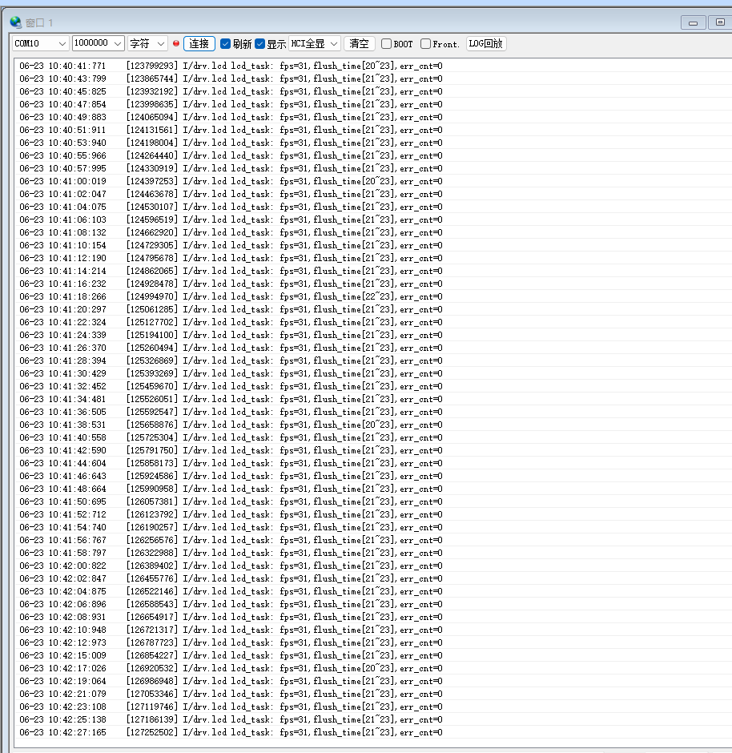
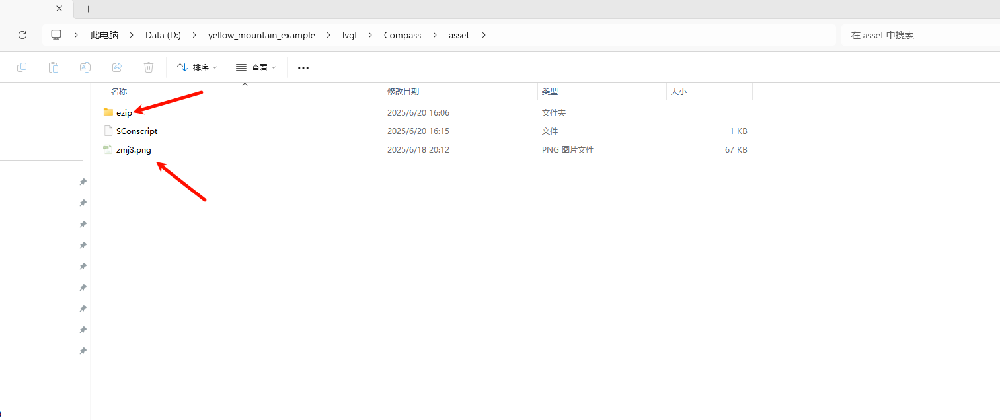

# 电子罗盘示例
使用LVGL v8(后续会有v9版本)做的，显示了圆形罗盘表盘、随着朝向转动的指针，以及显示当前朝向和角度
## 支持的平台
+ sf32lb52-lchspi-ulp

## 电子罗盘的介绍

* 使用MMC56x3传感器获取到的3轴磁力值，通过I2C接口读取数据，把数据通过数学库中的atan2f函数转化为角度，将每次获取到的角度设置为指针的偏转角度，用来控制指针的旋转。
* 本示例采用LVGL V8中的API来完成的界面布局与应用。

## 例程的使用

### 硬件需求
运行该例程前需要准备：
+ 一块本例程需要的开发板
+ 一根能够通讯的USB数据线

### 硬件配置

* 传感器通过I2C协议与开发板进行通信，具体连接引脚为 PA40（SCL 时钟线）和 PA39（SDA 数据线）
* 通过HAL_PIN_Set() 函数把IO引脚配置为I2C模式，设置为上拉模式，最后一个参数为hcpu/lcpu选择, 1:选择hcpu,0:选择lcpu 
```c
static void board_io_init(void)
{
    HAL_PIN_Set(PAD_PA40, I2C2_SCL, PIN_PULLUP, 1);
    HAL_PIN_Set(PAD_PA39, I2C2_SDA, PIN_PULLUP, 1);
}
```


### menuconfig配置流程
* 在menuconfig中打开MMC5603传感器和I2C2
* 这些配置默认已经进行了开启，用户不必自己在进行使能
```
scons --board=<name> --menuconfig
```

  


### 编译和烧录
切换到例程project目录，运行scons命令执行编译：
```
scons --board=sf32lb52-lchspi-ulp -j8
```
执行烧写命令：
```
build_sf32lb52-lchspi-ulp_hcpu\uart_download.bat
```
按提示选择端口即可进行下载：
```none
please input the serial port num:10
```

## 预期效果
* 能够模拟手机指南针功能，指明方向和角度
* 输入:lcd_ctrl fps 来进行查看帧率
* 具体演示视频参照链接：[罗盘演示视频](https://www.bilibili.com/video/BV1BxKmzaEVc/?spm_id_from=333.337.search-card.all.click&vd_source=00a26cb15a9627841023f7adb1c7c7f4)
 
 

## 异常诊断
如果未能达到了演示视频效果，可以从以下方面及逆行故障排除：
* 查看周边是否有磁铁或者能够影响局部磁场的设备

### 自定义罗盘界面
如果觉得罗盘中的表盘和指针不够漂亮或者需要自定义一些表盘和指针也是支持的
* 首先要保证自定义的图片是.png格式的
* 其次需要将图片放在asset文件下
* 将需要自定页面的表盘放在asset下，然后自定义指针放在ezip文件夹下即可，当然图片不宜过大，否则会影响罗盘整体帧率，表盘（390x390）、指针（230x230）
 
