# eez_studio示例（RT-Thread）

## 支持的平台
<!-- 支持哪些板子和芯片平台 -->
- 任意板子（包括`pc`）

## 例程概述 
使用eez_studio工具，将png图片转换成图片数组和lvgl使用的图片结构体，并生成C文件。将生成的.c文件放到工程下，进行修改编译（因为生成的结构体接口存在差异），在使用sdk中的lvgl接口将图片显示在屏幕上。

## eez_studio软件的使用
eez_studio软件下载地址：[eez_studio下载](https://github.com/eez-open/studio/releases)，选择.exe文件进行下载

* 下载安装好后打开eez_studio软件，并在首页进行创建工程
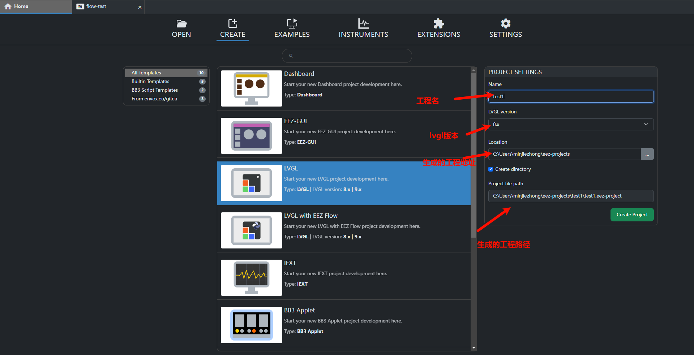

* 创建工程后，进行添加项目，如图所示操作
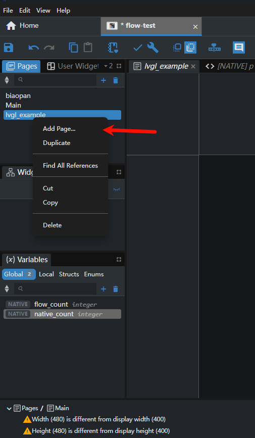
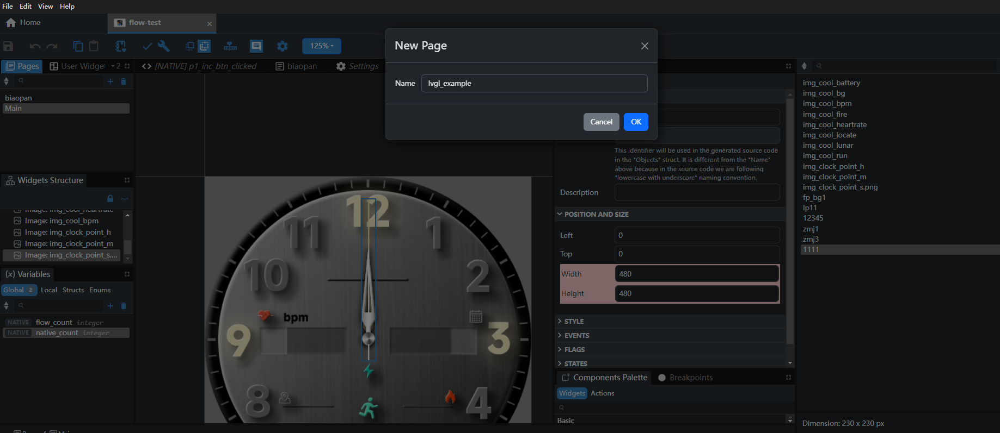

* 界面的使用，可以设置项目的大小，排版布局，以及样、标志位、小工具、事件、动作等
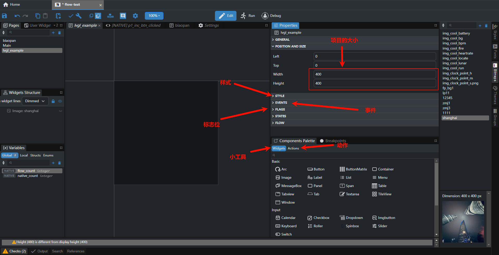

* 下面演示添加image控件
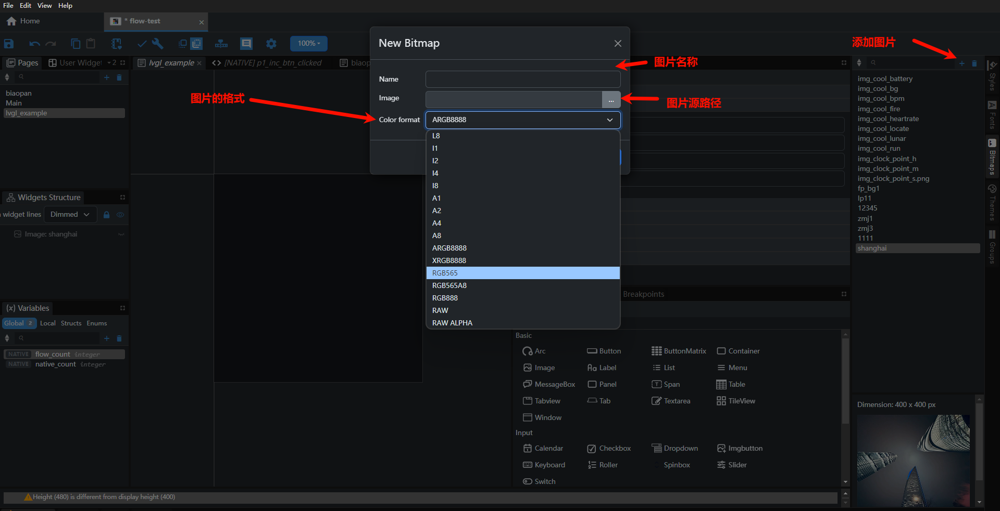

* 完成之后进行编译生成.c文件
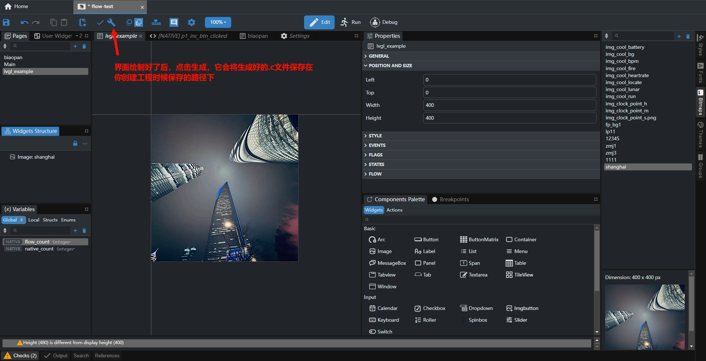

具体其他详细操作可以参考：[eez_studio教程](https://www.bilibili.com/video/BV1vkp2egERj?spm_id_from=333.788.videopod.sections&vd_source=00a26cb15a9627841023f7adb1c7c7f4)

## 生成完代码的修改
* 由于生成的代码与SDK的头文件引用存在一点差异，并不能完全使用，所以需要修改代码。（但是绝大部分代码都可以复用）
* 生成代码的我们可以参考image的ui_image_xxx.c 文件, 其中存放的是我们图片的数据以及接口。然后还有一个就是screens
* 我们需要进行一定的修改才能在我们的SDK中使用它，主要还是一些头文件的问题，需要我们进行如图中的操作
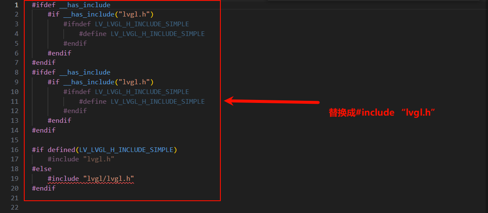

* 接下来就是创建lvgl界面了，生成的代码存放于screens.c文件中，跟我们的写法上也存在一点差异，所以需要调整一下（但是绝大部分代码都可以复用）
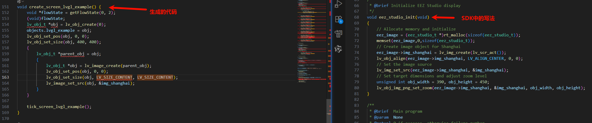


## 例程的使用
### 硬件需求
* 一块支持本例程的板子
* 一跟USB数据线

### menuconfig配置流程
* 默认已经开好LVGL，不需要进行任何配置
* 在menuconfig中开启LVGL
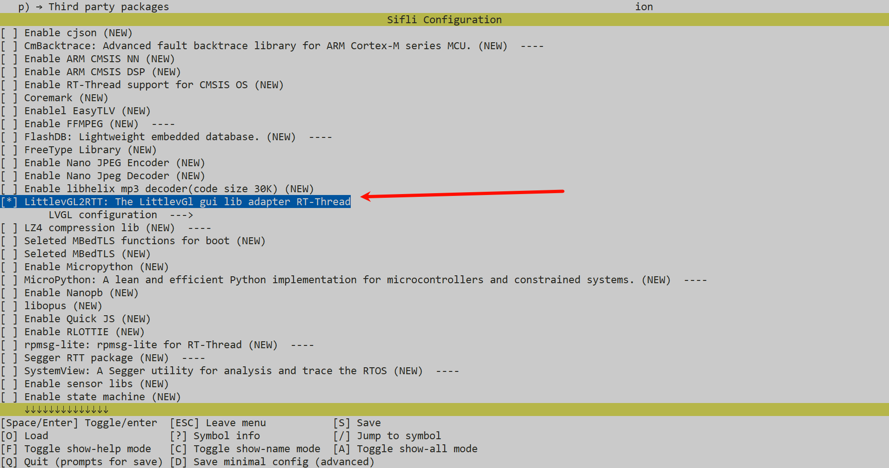
* 在menuconfig中选择LVGL的显示驱动
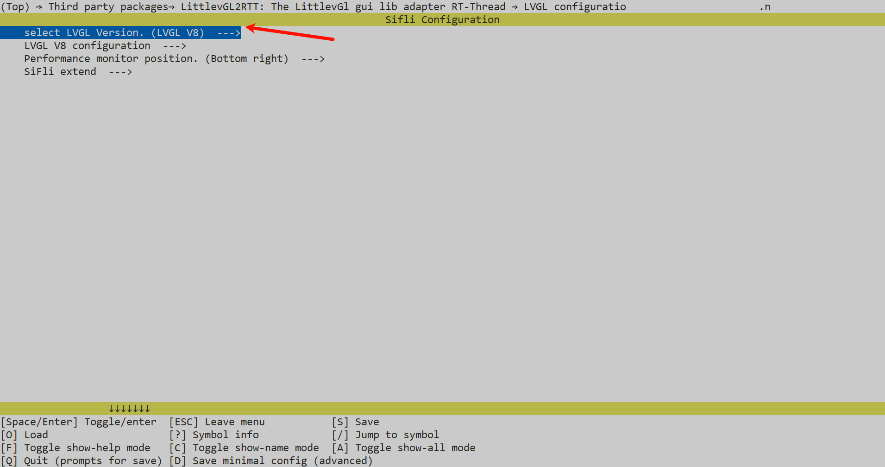
### 编译和烧录
切换到例程project目录，运行scons命令执行编译：
```
scons --board=sf32lb52-lcd_n16r8 -j32
```
```
build_sf32lb52-lcd_n16r8_hcpu\uart_download.bat
```

### 运行结果
* 屏幕上会显示转化的图片
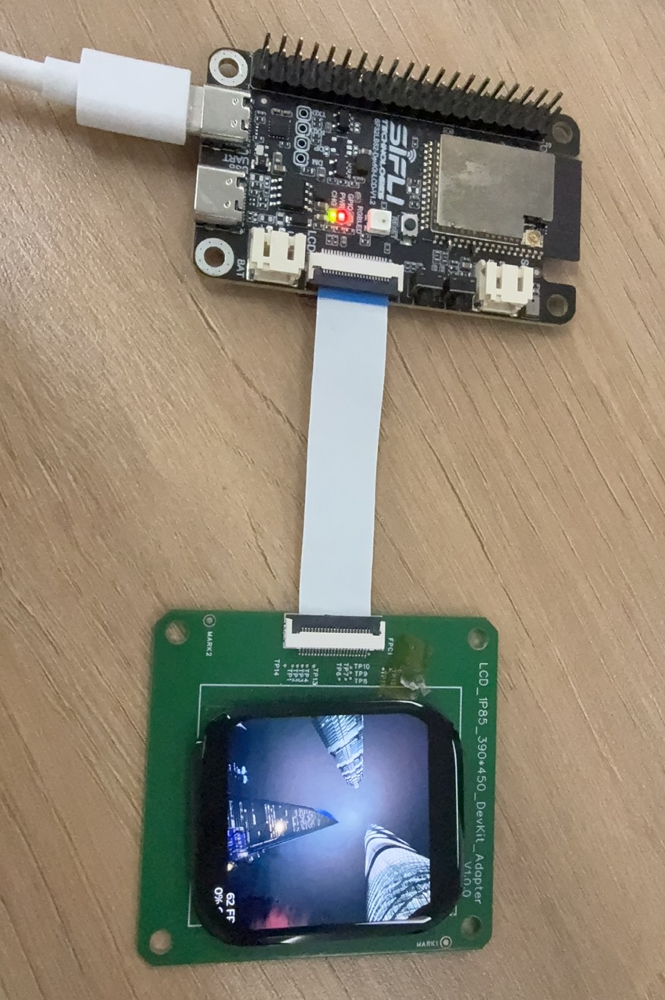


