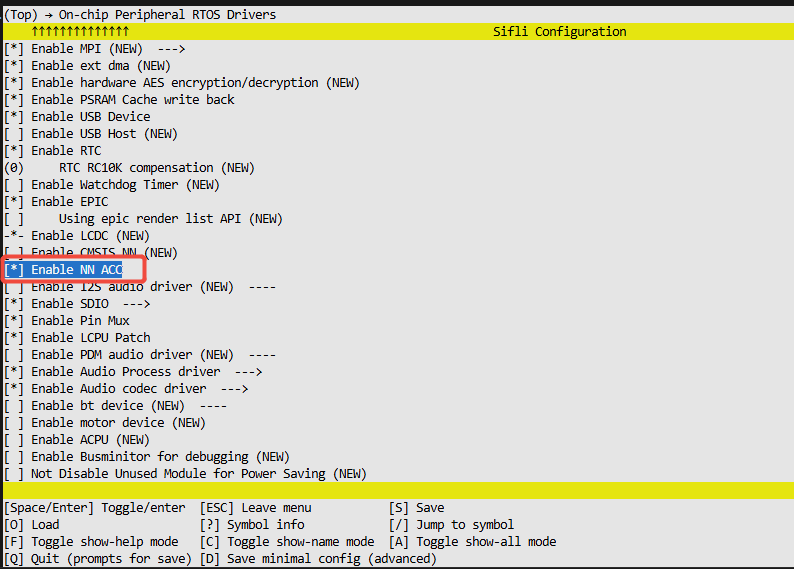

# NNACC示例
源码路径：example/hal/nnacc
## 支持的平台
例程可以运行在以下开发板.
* sf32lb58-lcd_a128r32n1_dsi

## 概述
NNACC （ Neural Network Accelerator） 的缩写，是 Sifli 芯片中提供的一个专用硬件模块，专门用于加速以下任务：

+ 卷积计算（Conv2D）
+ 深度可分离卷积（Depthwise Conv2D）
+ 高斯滤波
+ 其他 AI 推理相关运算

本例程示例：验证芯片上的硬件加速器是否能正确执行深度可分离卷积（Depthwise Convolution）操作。


## 例程的使用
```
\\例程核心流程
main()
├── 定义卷积参数（尺寸、通道数、步长、填充等）
├── 分配输入缓冲区：input, wt, bias
├── 分配输出缓冲区：output
├── 初始化 NN Accelerator 硬件 (drv_nnacc.c已经完成)
├── 填入随机数据模拟真实输入
├── 启动硬件推理：nn_acc_start[同步启动]nn_acc_start_IT[异步启动]，由顶部宏定义修改选择
├── 等待完成并校验结果
└── 输出测试结果（pass or fail）
```

### 编译和烧录
切换到例程project目录，运行scons命令执行编译(board=版型)：
```
scons --board=sf32lb58-lcd_a128r32n1_dsi -j8
```
`build_sf32lb58-lcd_a128r32n1_dsi_hcpu\uart_download.bat`，按提示选择端口即可进行下载：

```
build_sf32lb58-lcd_a128r32n1_dsi_hcpu\uart_download.bat

Uart Download

please input the serial port num:5
```

关于编译、下载的详细步骤，请参考[](/quickstart/get-started.md)的相关介绍。

### 硬件需求
运行该例程前，需要准备一块本例程支持的开发板（支持nnacc）
```
**注意**: 
1.在sf32lb58x当中大核默认使用hwp_nnacc1，小核默认使用hwp_nnacc2，具体芯片配置可查看对应register.h文件
2.sf32lb56x只有大核有一个hwp_nnacc1，小核没有nnacc,具体芯片配置可查看对应register.h文件

```

### menuconfig配置
打开NN_ACC开关



### 验证结果
#### 例程输出结果展示:
* log输出:
```
SFBL
```开机log```
```例程log: ```
Buffers initialized successfully.
fill_with_random_data. 2000fc60 20012808 20012894  200182bc, sp=2000e35f
HAL_NNACC_Start.
(msh />Async operation complete.) --异步模式的log
Test passed: NNACC result is correct.
msh />
```


## 异常诊断
如果未能出现预期的log,可以从以下方面进行故障排除：
* 硬件是否支持nnacc
* menuconfig是否打开对应开关


## 参考文档

## 更新记录
|版本 |日期   |发布说明 |
|:---|:---|:---|
|0.0.1 |7/2025 |初始版本 |
```