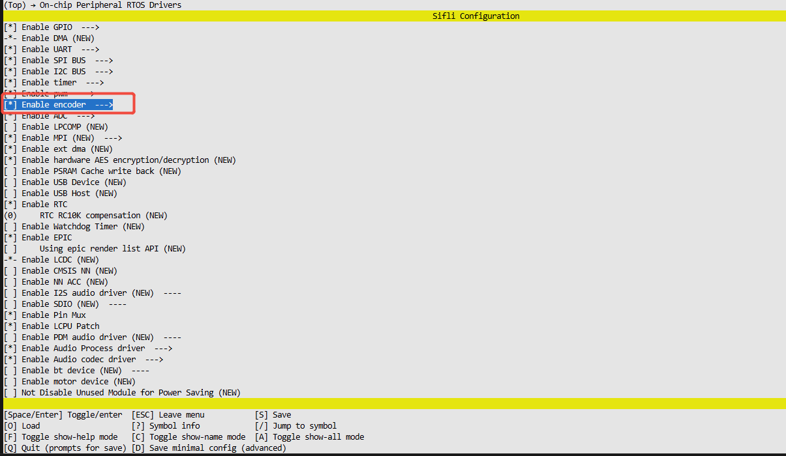
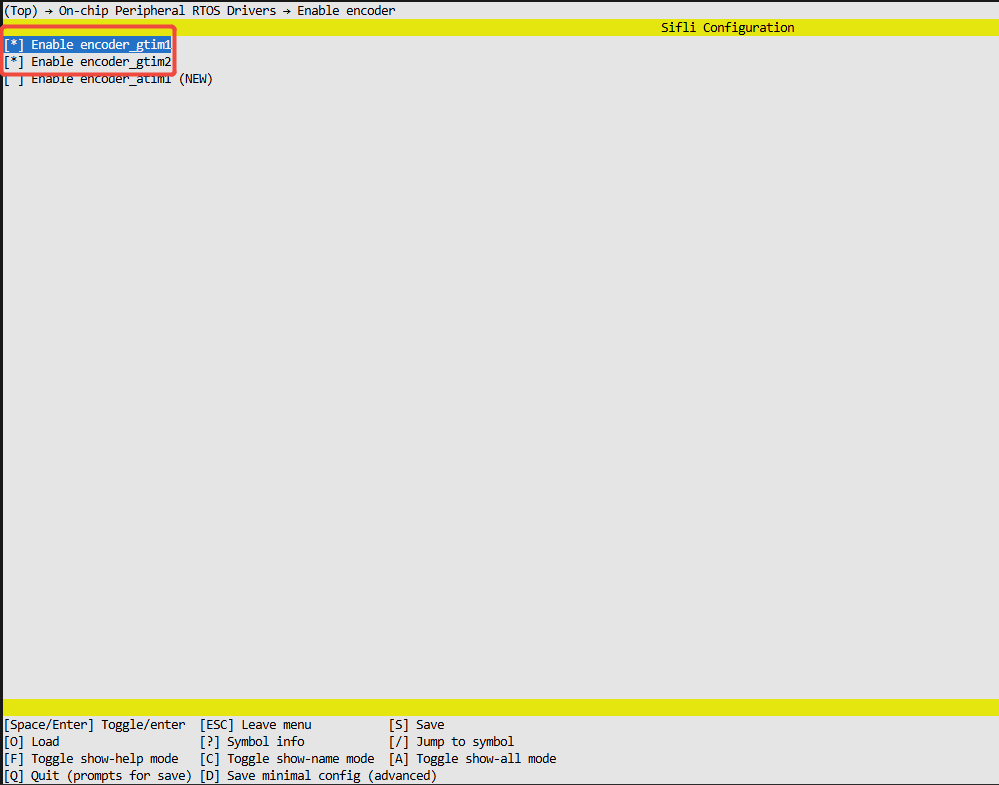

# pulse_encoder Example

Source path: example\rt_device\pulse_encoder
## Supported Platforms
The example can run on the following development boards.
* sf32lb58-lcd_n16r64n4
## Overview
* Pulse encoders can accurately measure the position of rotating shafts. Each rotation by a certain angle generates a pulse signal from the encoder. By counting these pulses, the current position of the rotating shaft can be determined.
* GPtimer encoder mode example where external pulse encoder controls timer CNT increment/decrement

## Example Usage
### Hardware Requirements
Before running this example, you need to prepare a development board supported by this example


### menuconfig Configuration



## Example Usage
### Compilation and Programming
Switch to the example project directory and run the scons command to execute compilation:

> scons --board=sf32lb58-lcd_n16r64n4 -j8

Switch to the example `project/build_xx` directory and run `download.bat`


> build_sf32lb58-lcd_n16r64n4_hcpu\download.bat


For detailed steps on compilation and downloading, please refer to the relevant introduction in [Quick Start](quick_start).
### Read GPtimer cnt value controlled by external device increment/decrement every second
#### Example Output Results Display:
* log output:
```
encoder_example_init!
succeed encoder_example_init
Start Get_count!
encoder_count:0
encoder_count:2
encoder_count:5
encoder_count:-4
msh />
```
* This example uses polling method to read cnt value every second


#### encoder channel selection parameter modification

|Form Factor Name  | GPTIMx_CHx   | Pin (Physical Position)     |    
|--------|---------------|-------------------|
|525     |               |                   |   
|        | GPTIM1_CH1    | PAD_PA24 (19)    |   
|        | GPTIM1_CH2    | PAD_PA25 (21)     |   
|587:   |               |                    |
|        | GPTIM1_CH1    |PAD_PA82 (CONN2 22)  |
|        | GPTIM1_CH2    |PAD_PA51 (CONN2 28)  |


```c

#ifdef SF32LB52X    
    HAL_PIN_Set(PAD_PA24, GPTIM1_CH1, PIN_PULLUP, 1);
    HAL_PIN_Set(PAD_PA25, GPTIM1_CH2, PIN_PULLUP, 1);
#elif defined SF32LB58X
    HAL_PIN_Set(PAD_PA82, GPTIM1_CH1, PIN_PULLUP, 1);
    HAL_PIN_Set(PAD_PA51, GPTIM1_CH2, PIN_PULLUP, 1);
#endif


```
**Note**: 
1. For 52x chips, can be configured to any IO with PA_TIM function as encoder channel
2. The last parameter of HAL_PIN_Set is hcpu/lcpu selection, 1: select hcpu, 0: select lcpu 


## Exception Diagnosis
If the expected log doesn't appear and rotation cannot increment/decrement cnt, you can troubleshoot from the following aspects:
* Whether hardware connection is normal
* Whether pin configuration is correct 


## Reference Documentation
- For rt_device examples, the RT-Thread official website documentation provides more detailed explanations, you can add webpage links here, for example, refer to RT-Thread's [RTC documentation](https://www.rt-thread.org/document/site/#/rt-thread-version/rt-thread-standard/programming-manual/device/rtc/rtc)

## Update Log
|Version |Date   |Release Notes |
|:---|:---|:---|
|0.0.1 |10/2024 |Initial version |
|0.0.2 | 12/2024| 2.0|
| | | |