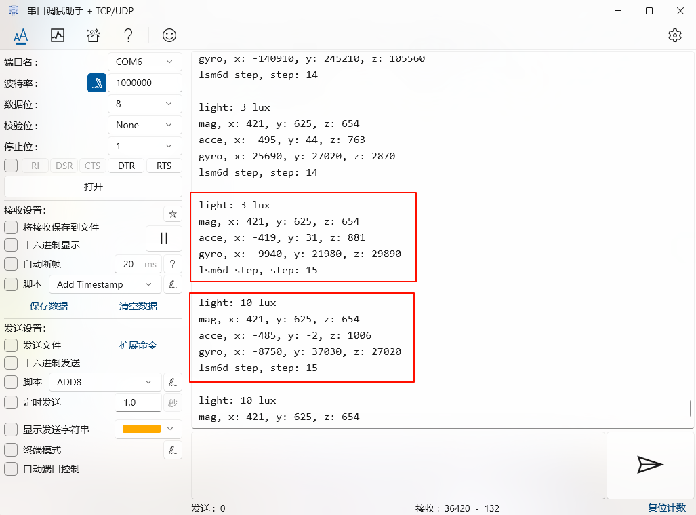
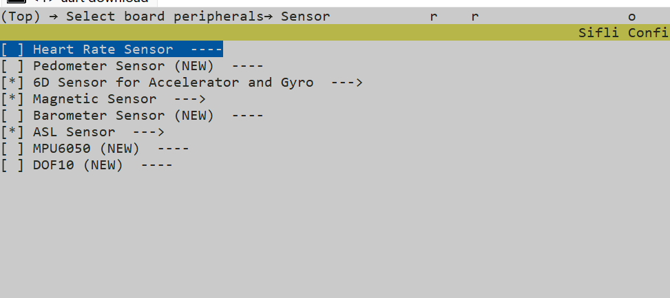
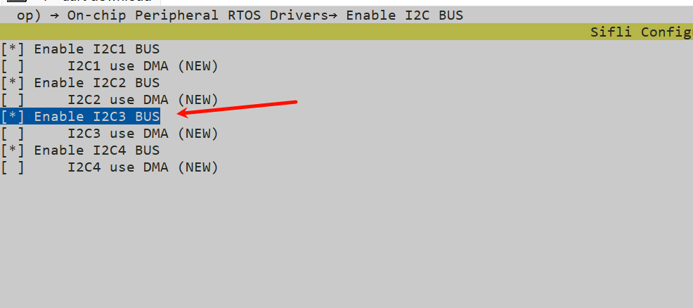
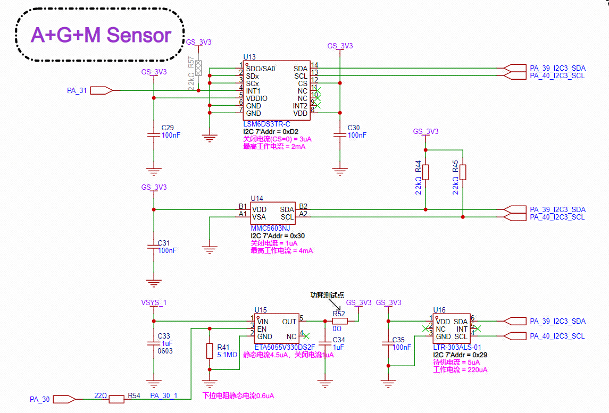

# Sensor Example
Sensors are an important part of the Internet of Things. "Sensors to IoT" is equivalent to "eyes to humans". If humans lose their eyes, they cannot see this vast and colorful world, and the same is true for IoT. A large number of sensors have been developed for developers to choose from, such as: Accelerometer, Magnetometer, Gyroscope, Barometer/pressure, Humidometer, etc.

Source code path: SiFli-SDK\example\rt_device\sensor

## Supported Platforms
* sf32lb52-lchspi-ulp

## Sensor Types and Introduction
* LTR303 sensor, MMC56X3 sensor, LSM6DS sensor
* SiFli-SDK is currently based on RT-Thread, so peripheral APIs are consistent with RT-Thread. For detailed API usage instructions, please refer to [RT-Thread sensor API](https://www.rt-thread.org/document/site/#/rt-thread-version/rt-thread-standard/programming-manual/device/sensor/sensor) documentation. In the following examples, we will gradually explain the usage of each API and how to add new sensors.

## Example Usage
### Compilation and Programming
Switch to the example project directory and run the scons command to execute compilation:
```
scons --board=sf32lb52-lchspi-ulp -j8
```
Execute programming command:
```
build_sf32lb52-lchspi-ulp_hcpu\uart_download.bat
```
Select the port as prompted to download:
```none
please input the serial port num:6
```

#### Example Output Results Display:
* After programming completion, serial port prints data from each sensor


#### Sensor Configuration Process
* Default configuration has been done, users do not need to modify it themselves
* Enable corresponding sensors and `I2C3` in menuconfig

```
menuconfig --board=sf32lb52-lchspi-ulp 
```



## Hardware Connection
Looking at the schematic of Lichee Huangshan Pi, we find that all sensors use `PA_39_I2C3_SDA` and `PA_40_I2C3_SLC` for data reception and transmission, with peripheral bus using `I2C3`.


## Hardware Configuration
* For sf32lb52-lchspi-ulp development board, it can be configured to any IO with PA*_I2C_UART functionality to output I2C SDA, SCLK waveforms. I2C name is not mandatory and can be configured as needed (I2C1~I2C4), here using I2C3 as example.
* Sensors communicate through I2C protocol, with specific connection pins being PA40 (SCL clock line) and PA39 (SDA data line)
* Configure IO pins to I2C mode through HAL_PIN_Set() function, set to pull-up mode. The last parameter is for hcpu/lcpu selection, 1: select hcpu, 0: select lcpu
```c
static void board_io_init(void)
{
    HAL_PIN_Set(PAD_PA40, I2C3_SCL, PIN_PULLUP, 1);
    HAL_PIN_Set(PAD_PA39, I2C3_SDA, PIN_PULLUP, 1);
}
```

## How to Add a New Sensor
### Add a Sensor Driver
* In SiFli-SDK\customer\peripherals\sensor folder, create a folder with the sensor name for the sensor driver code (e.g., magnetometer SiFli-SDK\customer\peripherals\sensor\MMC56x3)
* Create corresponding .c and .h files for sensor_name and sensor_memsic_(sensor_name) in the folder (e.g., magnetometer MMC56x3)
* Write the required driver code for the sensor in sensor_name.c file, including: sensor initialization code, I2C communication interface management, sensor register configuration, sensor data collection and processing, sensor working mode control (written according to sensor manual)
* Write sensor interface definitions in sensor_memsic_(sensor_name).c file, including: sensor initialization interface, sensor data acquisition interface, sensor working mode interface
* For specific operation steps, refer to [Sensor Addition Guide](https://docs.sifli.com/projects/sdk/latest/sf32lb52x/app_note/sensor.html)

### App Function Code
* 1. First confirm the connection pins between sensor and board, perform IO pin initialization through board_io_init function.
* 2. Add sensor initialization function, for example, MMC5603 sensor initialization function is rt_hw_mmc56x3_init.
* 3. Open and configure sensor device, first find the device (enable corresponding sensor in menuconfig for whichever sensor is added), then open sensor device for configuration.
* 4. Add sensor data acquisition function, for example, MMC5603 sensor data acquisition function uses rt_device_read interface function for data reading.
* 5. Finally print the read data

## Exception Diagnosis
* If data reading is abnormal or has abnormal jumps, check if rt_device_control correctly sets power mode, if there is electromagnetic interference