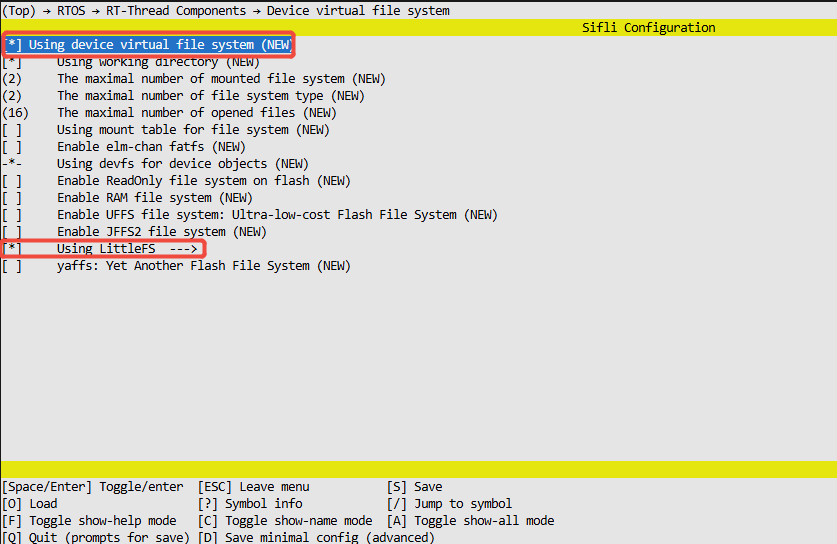

# LittleFs NOR 示例

源码路径：example/storage/littlefs

## 支持的平台
<!-- 支持哪些板子和芯片平台 -->

+ sf32lb52-lcd_n16r8


## 概述
<!-- 例程简介 -->
LittleFS 是一个专为嵌入式系统设计的轻量级、掉电安全的文件系统，特别适用于 NOR Flash等非易失性存储设备。


## 使用指南
本示例演示LittleFs的文件系统功能，在UART console可以调用常用的文件命令，如:

```
df               - Disk free
mountfs          - Mount device to file system
mkfs             - Format disk with file system
mkdir            - Create the DIRECTORY.
pwd              - Print the name of the current working directory.
cd               - Change the shell working directory.
rm               - Remove(unlink) the FILE(s).
cat              - Concatenate FILE(s)
mv               - Rename SOURCE to DEST.
cp               - Copy SOURCE to DEST.
ls               - List information about the FILEs.

```
  
### 文件系统打包

默认的编译脚本没有下载文件系统分区镜像文件，因此第一次运行程序如果mount失败会自动格式化分区，具体实现见`main.c`的函数`mnt_init`。SDK还提供了打包指定目录下的文件并生成文件系统镜像文件的功能，可以放开`SConstruct`里的如下代码，这段代码的作用是在编译时打包disk目录下的文件，在build目录下生成`fs_root.bin`文件，如果`ptab.json`的分区表中定义了`img`属性为`fs_root`的分区，下载脚本就会同时下载该bin文件。
      
```
# fs_bin=FileSystemBuild( "../disk", env)
# AddCustomImg("fs_root",bin=[fs_bin])
```
## 例程的使用说明
### 硬件需求
1、运行例程的前提，需要拥有一块支持该例程的开发板
2、一根具备数据传输能力的USB数据线
### menuconfig配置
```
 //执行指令
 menuconfig --board=em-lb561
```  
1、首先需要在menuconfig里面进行开启MTD Nor Flash device


2、使用设备虚拟文件系统，以及开启LittleFs文件系统


3、选择HAL Assert类型


### 编译和烧录
切换到例程project目录，运行scons命令执行编译：
```c
> scons --board=sf32lb52-lcd_n16r8 -j32
```
切换到例程`project/build_xx`目录，运行`uart_download.bat`，按提示选择端口即可进行下载：
```c
$ ./uart_download.bat

     Uart Download

please input the serial port num:5
```
关于编译、下载的详细步骤，请参考[快速上手](quick_start)的相关介绍。

## 例程的预期结果
下面结果展示了例程在开发板运行起来后的log。如果看不到这些log，就说明例程没能按预期运行成功，需要进行原因排查。
```
mount fs on flash root success//说明文件系统挂载成功
```
1、串口发送ls查看根目录下的文件

2、输入mkdir test2，创建test2文件夹（目录）

3、再次输入ls，看test2文件夹（目录）是否创建成功

4、输入pwd查看当前工作路径


## 异常诊断
如果log未能出现预期的log和现象，可以从已下几个方面进行故障排查：
* 硬件连接是否正常
* 检查USB线是否具备数据传输功能
* 上面的menuconfig是否配置对了