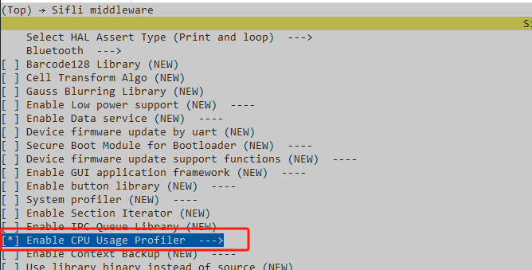
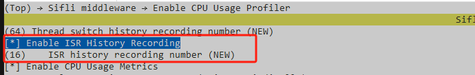
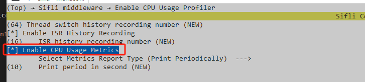
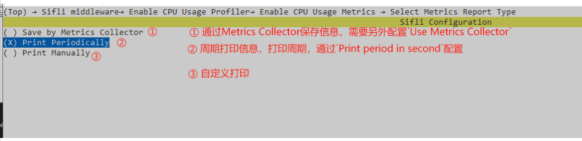
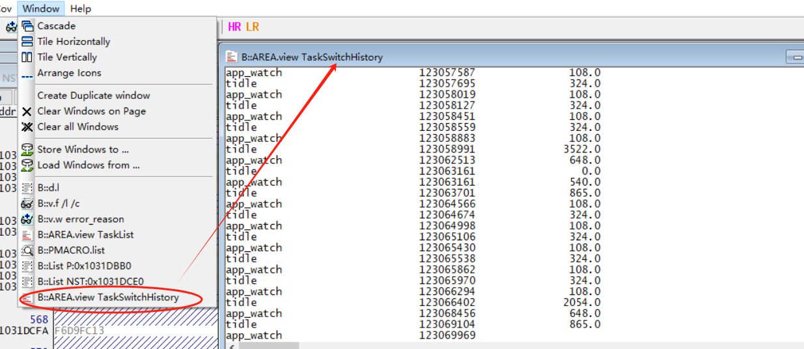

# cpu_usage_profiler示例
源码路径：example/system/cpu_usage_profiler
## 支持的平台
<!-- 支持哪些板子和芯片平台 -->
+ sf32lb52-lcd_n16r8

## 概述
<!-- 例程简介 -->
例程演示cpu_usage_profiler的配置使用，功能包括：
+ CPU使用统计：空闲时间（idle_run_time）、非空闲时间（other_run_time）、CPU使用率（默认2s统计一次）。
+ 线程切换历史记录。记录每次线程切换的线程名、切换发生的时间。
+ 中断历史记录。记录中断的中断号、中断触发时间。
+ CPU Usage Metrics。记录CPU空闲时间（idle time）、非空闲时间（other run time）、线程运行时间（thread run time）。支持：
     + 周期打印。
     + 通过`Metrics Collector`功能收集存储。

```{tip}
+ 线程切换、中断记录的时间是根据GTIMER计算的开机时间（秒/微秒）。
+ `CPU Usage Metrics`的统计信息在每次收集或者打印后清除重启开始统计。
```

## 例程的使用
<!-- 说明如何使用例程，比如连接哪些硬件管脚观察波形，编译和烧写可以引用相关文档。
对于rt_device的例程，还需要把本例程用到的配置开关列出来，比如PWM例程用到了PWM1，需要在onchip菜单里使能PWM1 -->

### 硬件需求
运行该例程前，需要准备一块本例程支持的开发板。

### menuconfig配置
1. 使能cpu usage profiler（总开关）：  

2. 配置任务切换记录数量：  

3. 配置中断历史记录（使能、配置记录数量）：  

4. 配置CPU Usage Metrics：    
4.1 使能Metrics：  
  
4.2 配置report type：    

     ```{tip}
     本例程中，`report type`配成为周期打印。
     ```

### 编译和烧录
切换到例程project目录，运行scons命令执行编译：
```
scons --board=sf32lb52-lcd_n16r8 -j32
```
运行`build_sf32lb52-lcd_n16r8_hcpu\uart_download.bat`，按提示选择端口即可进行下载：
```
$ ./uart_download.bat

     Uart Download

please input the serial port num:5
```
关于编译、下载的详细步骤，请参考[](/quickstart/get-started.md)的相关介绍。

## 例程的预期结果
<!-- 说明例程运行结果，比如哪几个灯会亮，会打印哪些log，以便用户判断例程是否正常运行，运行结果可以结合代码分步骤说明 -->
1. 线程切换历史保存在`thread_switch_hist`，中断历史记录保存在`isr_hist`，可以通过`ozone\T32`等在线或者离线手段查看变量。比如，发生异常时，可以通过T32方便地看到线程切换记录：

2. 配置CPU Usage Metrics为周期打印时，会周期打印`CPU Usage`信息（这里配置的打印周期为10s）：
     ```c
     07-03 17:59:52:616    [328360] I/NO_TAG: ============================
     07-03 17:59:52:625    [328382] I/NO_TAG: CPU Usage:    9.93/   9.94 (   0.15%)
     07-03 17:59:52:632    [328411] I/NO_TAG: ========================================================
     07-03 17:59:52:641    [328442] I/NO_TAG: thread      run_time(s)    load(%)
     07-03 17:59:52:648    [328465] I/NO_TAG: --------------------------------------------------------
     07-03 17:59:52:662    [328496] I/NO_TAG: [tshell  ]:    0.01    0.15% 
     07-03 17:59:52:672    [328518] I/NO_TAG: [tidle   ]:    9.93   99.85% 
     07-03 17:59:52:680    [328540] I/NO_TAG: [timer   ]:    0.00    0.00% 
     07-03 17:59:52:692    [328562] I/NO_TAG: [main    ]:    0.00    0.00% 
     07-03 17:59:52:813    
     07-03 18:00:02:607    [656066] I/NO_TAG: ============================
     07-03 18:00:02:619    [656087] I/NO_TAG: CPU Usage:    9.99/  10.00 (   0.07%)
     07-03 18:00:02:627    [656112] I/NO_TAG: ========================================================
     07-03 18:00:02:637    [656143] I/NO_TAG: thread      run_time(s)    load(%)
     07-03 18:00:02:644    [656166] I/NO_TAG: --------------------------------------------------------
     07-03 18:00:02:653    [656197] I/NO_TAG: [tshell  ]:    0.00    0.00% 
     07-03 18:00:02:660    [656218] I/NO_TAG: [tidle   ]:    9.99   99.93% 
     07-03 18:00:02:670    [656240] I/NO_TAG: [timer   ]:    0.01    0.07% 
     07-03 18:00:02:678    [656262] I/NO_TAG: [main    ]:    0.00    0.00% 
     07-03 18:00:02:801    
     07-03 18:00:12:602    [983795] I/NO_TAG: ============================
     07-03 18:00:12:607    [983816] I/NO_TAG: CPU Usage:    9.99/  10.00 (   0.07%)
     07-03 18:00:12:809    [983841] I/NO_TAG: ========================================================
     07-03 18:00:12:830    [983872] I/NO_TAG: thread      run_time(s)    load(%)
     07-03 18:00:12:853    [983895] I/NO_TAG: --------------------------------------------------------
     07-03 18:00:12:865    [983926] I/NO_TAG: [tshell  ]:    0.00    0.00% 
     07-03 18:00:12:874    [983948] I/NO_TAG: [tidle   ]:    9.99   99.93% 
     07-03 18:00:12:883    [983970] I/NO_TAG: [timer   ]:    0.01    0.07% 
     07-03 18:00:12:897    [983991] I/NO_TAG: [main    ]:    0.00    0.00% 
     ```
3. 支持的FINSH命令：
     命令|说明 
     --|--
     `cpu_prof_init`|初始化profiler功能
     `cpu_prof_deinit`|取消profiler功能
     `cpu_prof_reset`|重置CPU统计数据
     `cpu`|打印CPU统计信息（如果使能了`CPU Usage Metrics`，也会打印各线程负载）

     如下为`cpu`命令打印（这里使能了`CPU Usage Metrics`）:
     ```c
     07-03 23:35:53:806 TX:cpu
     07-03 23:35:53:811    [1049619] I/NO_TAG: CPU usage: 0.33
     07-03 23:35:53:814    
     07-03 23:35:53:819    [1049637] I/NO_TAG: ============================
     07-03 23:35:53:822    [1049659] I/NO_TAG: CPU Usage:    1.94/   1.95 (   0.34%)
     07-03 23:35:53:828    [1049684] I/NO_TAG: ========================================================
     07-03 23:35:53:832    [1049715] I/NO_TAG: thread      run_time(s)    load(%)
     07-03 23:35:53:837    [1049739] I/NO_TAG: --------------------------------------------------------
     07-03 23:35:53:839    [1049770] I/NO_TAG: [tshell  ]:    0.00    0.00% 
     07-03 23:35:53:844    [1049792] I/NO_TAG: [tidle   ]:    1.94   99.66% 
     07-03 23:35:53:848    [1049814] I/NO_TAG: [timer   ]:    0.01    0.34% 
     07-03 23:35:53:852    [1049836] I/NO_TAG: [main    ]:    0.00    0.00% 
     ```


## 异常诊断


## 参考文档
<!-- 对于rt_device的示例，rt-thread官网文档提供的较详细说明，可以在这里添加网页链接，例如，参考RT-Thread的[RTC文档](https://www.rt-thread.org/document/site/#/rt-thread-version/rt-thread-standard/programming-manual/device/rtc/rtc) -->


## 更新记录
|版本 |日期   |发布说明 |
|:---|:---|:---|
|0.0.1 |07/2025 |初始版本 |
| | | |
| | | |
